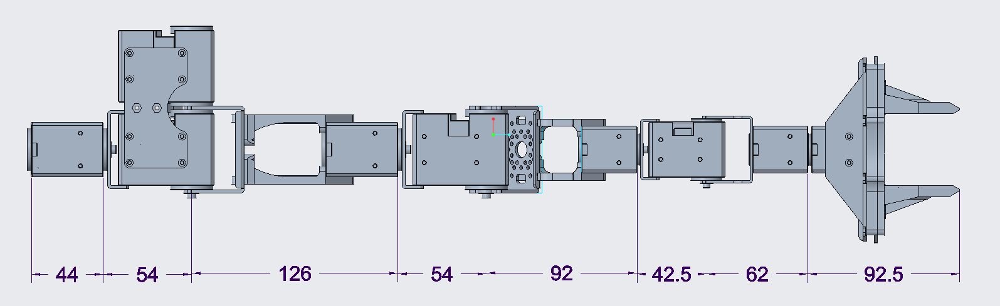
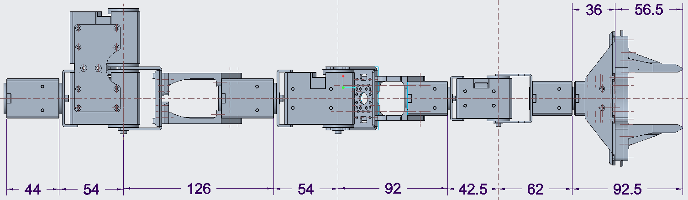

# Dynamixel 7dof robot manipulator

## Frame definition

|         | Link length | Joint type |
| :-----: | :---------: | :--------: |
| Link 1  |   0.0440m   |  Revolute  |
| Link 2  |   0.0540m   |  Revolute  |
| Link 3  |   0.1260m   |  Revolute  |
| Link 4  |   0.0540m   |  Revolute  |
| Link 5  |   0.0920m   |  Revolute  |
| Link 6  |   0.0425m   |  Revolute  |
| Link 7  |   0.0620m   |  Revolute  |
| Gripper |   0.0925m   | Prismatic  |

## D-H parameters
|  $i$  | $\alpha_i$ | $a_i$ |  $d_i$  | $\theta_i$ |
| :---: | :--------: | :---: | :-----: | :--------: |
|   1   |  $-\pi/2$  |   0   | 0.0980m | $\theta_1$ |
|   2   |  $\pi/2$   |   0   |    0    | $\theta_2$ |
|   3   |  $-\pi/2$  |   0   |  0.18m  | $\theta_3$ |
|   4   |  $\pi/2$   |   0   | 0.1345m | $\theta_4$ |
|   5   |  $-\pi/2$  |   0   |    0    | $\theta_5$ |
|   6   |  $\pi/2$   |   0   |    0    | $\theta_6$ |
|   7   |     0      |   0   | 0.1545m | $\theta_7$ |

## Bill of material
|       Item       | Quantity |                      Purchase link                       |
| :--------------: | :------: | :------------------------------------------------------: |
|   XM540-W270-R   |    5     | https://www.robotis.com/shop/item.php?it_id=902-0133-000 |
|   XM430-W350-R   |    4     | https://www.robotis.com/shop/item.php?it_id=902-0118-000 |
|    FR13-H101K    |    2     | https://www.robotis.com/shop/item.php?it_id=903-0270-300 |
|    FR13-S102K    |    2     | https://www.robotis.com/shop/item.php?it_id=903-0269-300 |
|    FR12-H101K    |    1     | https://www.robotis.com/shop/item.php?it_id=903-0239-000 |
|    FR12-H104K    |    1     | https://www.robotis.com/shop/item.php?it_id=903-0263-100 |
|    FR12-S102K    |    1     | https://www.robotis.com/shop/item.php?it_id=903-0242-000 |
| X4P 240mm cable  |    1     | https://www.robotis.com/shop/item.php?it_id=903-0245-000 |
|     M2.5 nut     |    32    | https://www.robotis.com/shop/item.php?it_id=903-0058-000 |
|   M2.5*4 bolt    |    12    | https://www.robotis.com/shop/item.php?it_id=903-0063-000 |
|   M2.5*6 bolt    |    18    | https://www.robotis.com/shop/item.php?it_id=903-0064-000 |
|   M2.5*10 bolt   |    14    |                            /                             |
| 3D printed parts |    /     |                          ./stl                           |
